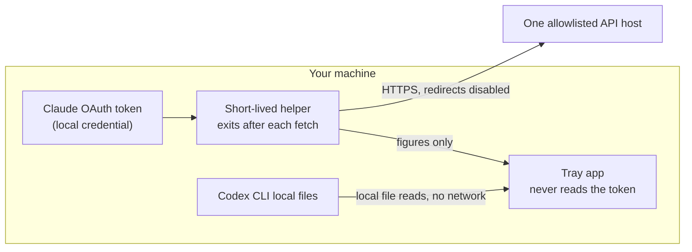

<p align="center">
  
</p>

# AI-Usage

One Windows tray for your Claude and Codex limits. Every figure is live, dated, or n/a. Nothing is estimated.


[Install](#install) · [Never a wrong number](#never-a-wrong-number) · [Security model](#security-model) · [Configuration](#configuration)

<p align="center">
  
</p>

Both providers in one popup. The states are the point: LIVE is fresh, DATED is last-known with its timestamp, and n/a says why. When AI-Usage cannot know a number, it tells you that instead.

<sub>Screenshot from v1.x, July 2026.</sub>

## Why

I use Claude Code and the Codex CLI heavily, and each lives under its own ceiling: a five-hour window and a weekly cap, counted separately by two different vendors. Hitting either one mid-session is a bad surprise, and the only way to check was to open two different tools and read two different screens. AI-Usage puts both on one tray icon. As far as I can find, nothing else on Windows shows both.

## Never a wrong number

A figure is shown as current only when it is provider-reported, validated, and inside the freshness window. "Accurate" here means honestly sourced and honestly labelled, not a claim that software can never contain bugs.

| State | Meaning | What you see |
|-------|---------|--------------|
| **LIVE** | Fresh, provider-reported, validated | Current figures |
| **DATED** | A fresh fetch failed; these are the last known values | "as of 14:32", never presented as current |
| **n/a** | No authoritative value exists right now | "n/a" plus the reason, in the popup itself |

There is no estimator anywhere in the code: no interpolation, no burn-rate projection, no reconstructed percentage, no cached value silently promoted back to LIVE. If AI-Usage cannot know a number, it says so, and says why, in the UI, so you never have to consult a FAQ to find out.

## Install

Requirements: Windows 10 or 11. Claude figures need Claude Code or the Claude desktop app signed in on this machine; Codex figures need the Codex CLI. Either alone is fine, the missing provider simply shows an n/a card. To build the installer you need the .NET 9 SDK; to run the app you need the .NET 9 Desktop Runtime.

1. Clone the repo and run the installer (no administrator rights, installs per-user to `%LOCALAPPDATA%\Programs\AIUsage`):
   ```powershell
   cd Installer
   ./install.ps1
   ```
2. The tray icon appears. Windows 11 hides new tray icons in the overflow (`^`) flyout by default, so drag it onto the taskbar to keep it glanceable. The app tells you this once on first run.
3. Left-click for the detail popup, right-click for the menu (Refresh, Settings, Enable Claude usage, Exit).

The installer is currently unsigned, so Windows SmartScreen may warn on first run: choose More info, then Run anyway. To remove it later, run `Installer/uninstall.ps1`.

## What it shows

- **Claude** (on your Claude subscription): five-hour and weekly limit %, per-model where the account reports it.
- **Codex CLI** (on your ChatGPT subscription): five-hour and weekly %, credits balance, and plan.

The tray icon reflects the worst live figure across both providers, and carries an unknown mark when an expected value cannot be read. Threshold notifications fire once when a window crosses your warning or critical level and re-arm when that window resets; a transition notification fires if a provider stays unavailable for more than five minutes. The settings window tunes thresholds, the freshness window, notifications, and start-with-Windows (see [Configuration](#configuration)).

## Security model

The sensitive part is the Claude side, which reads a local OAuth token. The design is a set of invariants you can check against the source, not a promise:

- The long-running tray process never reads the Claude OAuth token. Only a short-lived helper process touches it, and that process exits as soon as its one request returns.
- The helper sends the token to exactly one allowlisted host, over HTTPS, with redirect-following disabled, so a redirect can never forward the bearer somewhere else.
- The token leaves the helper only inside that one request. It is never returned to the tray, never persisted by AI-Usage, never written to logs or crash dumps, and the refresh token is never read at all.
- The Codex side makes no network calls. It reads the Codex CLI's local session files and nothing more.
- A failure or malformed response from one provider cannot change the other provider's state; the two run in isolation.
- Zero third-party runtime packages: the code that can see your credential is this repository plus the .NET runtime, and nothing else.



The absence of any edge between the Claude and Codex lanes is the isolation claim.

## About the Claude endpoint

> [!NOTE]
> AI-Usage reads the same usage endpoint the Claude apps themselves use. Anthropic does not document it for third parties, and it may change or be restricted at any time; whether to use it under your subscription's terms is a call you make, knowing the app only fetches your own account's figures and changes nothing. It is built for the day the endpoint moves: the Claude card degrades to n/a with a reason, the Codex card keeps working, and no number is invented to fill the gap.

## Configuration

Settings live in the tray's Settings window and persist to `%LOCALAPPDATA%\AIUsage\config.json`.

| Setting | Default | Effect |
|---------|---------|--------|
| Warning threshold | 80% | The tray icon turns to the warning colour at or above this. |
| Critical threshold | 90% | The tray icon turns critical at or above this. |
| Codex freshness window | 20 min | How long a Codex reading counts as LIVE before it becomes DATED. |
| Notifications | On | Threshold and transition balloons (see below). |
| Start with Windows | Off | Registers or removes a per-user start-at-logon entry. |
| Claude usage | On | Enables the Claude collector. Turn it off to stop reading the endpoint entirely. |

A threshold notification fires once per window per crossing of the warning or critical level, and re-arms only when that window resets, so it never repeats every refresh. Raising the freshness window changes when a Codex reading becomes DATED. It never authorizes an estimate.

## Under the hood

Built on .NET 9: a WPF popup and a WinForms tray icon in one process, with no browser engine. The domain core (the accuracy contract, the two collectors, the freshness engine) is a UI-free library with no Windows dependencies; the credential-touching helper is a separate BCL-only executable. Providers are isolated so one failing cannot degrade the other, and there are zero third-party runtime packages. The framework-dependent build is a few hundred kilobytes of app code on top of the shared .NET 9 Desktop Runtime; idle memory sits around 40 MB.

<details>
<summary>Build and test from source</summary>

```powershell
cd projects/ai-usage        # or the repo root if this is the standalone AI-Usage repo
./build.ps1                 # dotnet build (Release) + full test suite
./run.ps1                   # publish to ./dist and launch
```
The design, the build plan, and the empirical findings that pin the real Claude and Codex data shapes are in `DESIGN.md`, `PLAN.md`, and `spikes/`.
</details>

## License and disclaimer

See [LICENSE](LICENSE). Not affiliated with Anthropic or OpenAI. Claude, ChatGPT, and Codex are trademarks of their respective owners.
