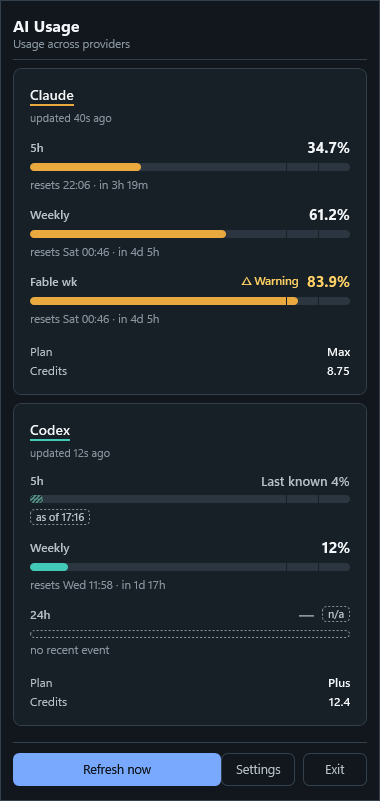
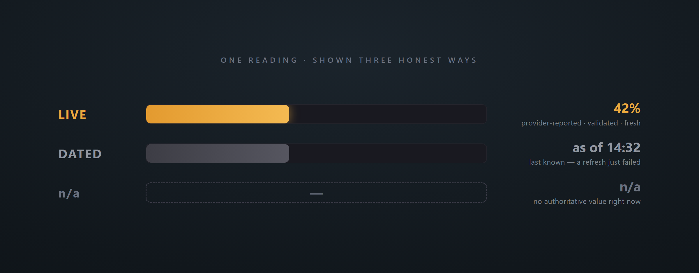

<!-- IMG-1: hero -->


# AI-Usage

**One Windows tray for your Claude and Codex limits.** Every figure is live, dated, or n/a — nothing is ever estimated.

[](#install)
[](#under-the-hood)
[](LICENSE)

If you run Claude Code and the Codex CLI hard, you live under two separate ceilings — a five-hour window and a weekly cap, counted by two different vendors, in two different tools. Hitting either one mid-session is a bad surprise. AI-Usage puts both on one tray icon, and it is honest to a fault about what it actually knows. As far as I can find, nothing else on Windows shows both.

<!-- IMG-2: screenshot -->
<p align="center">
  
</p>

Two providers, two independent cards, one glance. **The states are the whole point.**

## Live, dated, or gone — never wrong

<!-- IMG-3: accuracy -->


Most usage widgets will happily show you a number that stopped being true ten minutes ago. This one won't. A figure is presented as **current only** when it is provider-reported, validated, and inside its freshness window. The moment that stops being true, it changes state in front of you:

| State | What it means | What you see |
|-------|---------------|--------------|
| **LIVE** | Fresh, provider-reported, validated | The current figure, plainly |
| **DATED** | A refresh failed; this is the last value that *was* true | "as of 14:32" — clearly historical, never dressed up as current |
| **n/a** | No authoritative value exists right now | "n/a" and the reason, right there in the popup |

There is **no estimator anywhere in the code** — no interpolation, no burn-rate projection, no reconstructed percentage, no cached value quietly promoted back to LIVE. If AI-Usage can't *know* a number, it tells you so, and tells you why. That constraint is the product.

## Your token barely moves

<!-- IMG-4: trust boundary -->


The Claude side reads a local OAuth token, so the design is a set of invariants you can check against the source — not a paragraph of reassurance:

- The long-running tray process **never reads the token.** Only a short-lived helper touches it, and that process exits the instant its one request returns.
- The helper sends the token to **exactly one allowlisted host**, over HTTPS, with redirect-following disabled — a redirect can't smuggle the bearer anywhere else.
- The token leaves the helper **only inside that one request.** It's never returned to the tray, never persisted, never written to a log or crash dump, and the refresh token is never read at all.
- The **Codex side makes no network calls** — it reads local Codex CLI files and nothing more.
- One provider failing or returning garbage **cannot change the other's state.** They run in isolation.
- **Zero third-party runtime packages.** The code that can see your credential is this repository plus the .NET runtime — full stop.

There is no path between the Claude lane and the Codex lane — you can see it in the diagram above: two separate colours reaching the tray, never each other. That absence *is* the isolation guarantee.

## What it shows

- **Claude** (your Claude subscription): five-hour and weekly limit %, per-model where your account reports it.
- **Codex CLI** (your ChatGPT subscription): five-hour and weekly %, credits balance, and plan.

The tray icon tracks the worst live figure across both providers and carries an unknown mark whenever an expected value can't be read. A notification fires once when a window crosses your warning or critical level (and re-arms when that window resets), and once more if a provider stays unavailable for over five minutes. The Settings window tunes the thresholds, the freshness window, notifications, and start-with-Windows.

## Install

Grab the latest `.msi` from [Releases](../../releases) and run it. It installs **per-user, with no administrator rights**, is self-contained (no .NET runtime to install separately), adds a Start Menu entry, and can start with Windows.

The installer is unsigned, so Windows SmartScreen may warn on first run: choose **More info → Run anyway**.

> After it launches, Windows 11 hides new tray icons in the overflow (`^`) flyout by default. Drag it onto the taskbar to keep it glanceable — the app reminds you once.

<details>
<summary>Run or build from source</summary>

```powershell
cd projects/ai-usage     # or the repo root, in the standalone AI-Usage repo
./run.ps1                # publish to ./dist and launch
./build.ps1              # build (Release) + the full test suite
cd Installer && ./build-msi.ps1   # produce the .msi yourself
```
Design, plan, and the empirical findings that pin the real Claude and Codex data shapes are in `DESIGN.md`, `PLAN.md`, and `spikes/`.
</details>

## About the Claude endpoint

> [!NOTE]
> AI-Usage reads the same usage endpoint the Claude apps themselves use. Anthropic doesn't document it for third parties, and it may change or be restricted at any time; whether to use it under your subscription's terms is your call — knowing the app only ever fetches your own account's figures and changes nothing. It's built for the day the endpoint moves: the Claude card degrades to n/a with a reason, the Codex card keeps working, and no number is invented to fill the gap.

## Configuration

Settings live in the tray's Settings window and persist to `%LOCALAPPDATA%\AIUsage\config.json`.

| Setting | Default | Effect |
|---------|---------|--------|
| Warning threshold | 80% | Icon turns to the warning colour at or above this. |
| Critical threshold | 90% | Icon turns critical at or above this. |
| Codex freshness window | 20 min | How long a Codex reading counts as LIVE before it becomes DATED. |
| Notifications | On | Threshold and provider-transition balloons. |
| Start with Windows | Off | Adds or removes a per-user start-at-logon entry. |
| Claude usage | On | Enables the Claude collector; turn it off to stop reading the endpoint entirely. |
| Overrides (plan · Codex weekly reset) | unset | Optional values you already know — your plan and your Codex weekly-reset schedule. |

A threshold notification fires once per window per crossing and re-arms only when that window resets — it never nags every refresh. Raising the freshness window changes *when* a Codex reading becomes DATED; it never authorizes an estimate.

**Overrides never bend the accuracy rule.** The plan and Codex weekly-reset you enter under *Settings → Overrides* are shown **only** where the provider itself reported nothing, always tagged as *your setting* — never coloured or styled as a live, provider-reported figure. They fill a blank with what you know; they never overwrite real data or invent one.

## Under the hood

.NET 9: a WPF popup and a WinForms tray icon in one process, no browser engine. The domain core — the accuracy contract, both collectors, the freshness engine — is a UI-free library with no Windows dependencies. The credential-touching helper is a separate BCL-only executable. Providers are isolated so one can't drag down the other, and there are zero third-party runtime packages. Built empirically: the real Claude endpoint and real Codex session files were captured first (see `spikes/`) so the parsers match reality, then the whole thing went through a two-model code review before release.

## License and disclaimer

See [LICENSE](LICENSE). Not affiliated with Anthropic or OpenAI. Claude, ChatGPT, and Codex are trademarks of their respective owners.
